# Techneers

This is the README file for Techneers.

<b>Generative AI Demo</b>

<b>Landing Page<b>
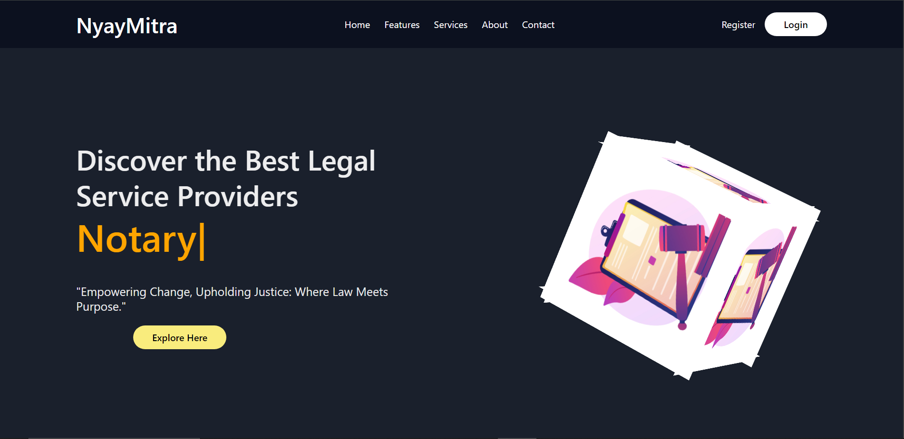
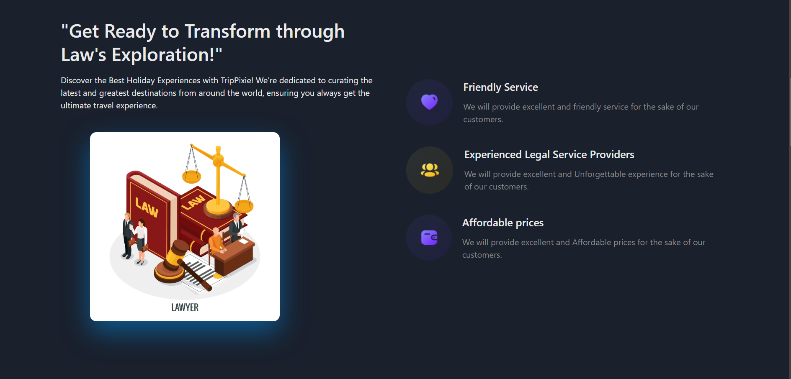
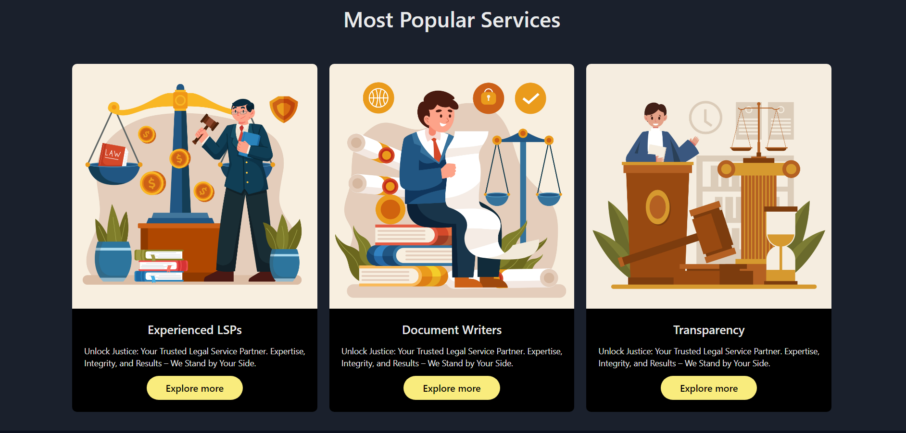

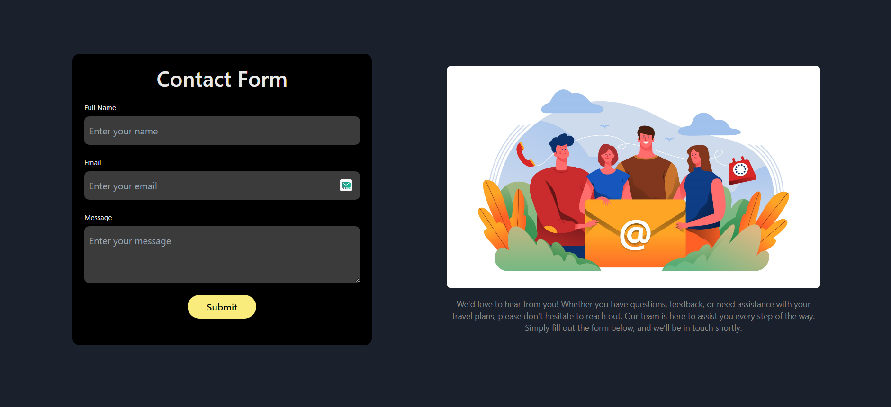

<b>Login</b>
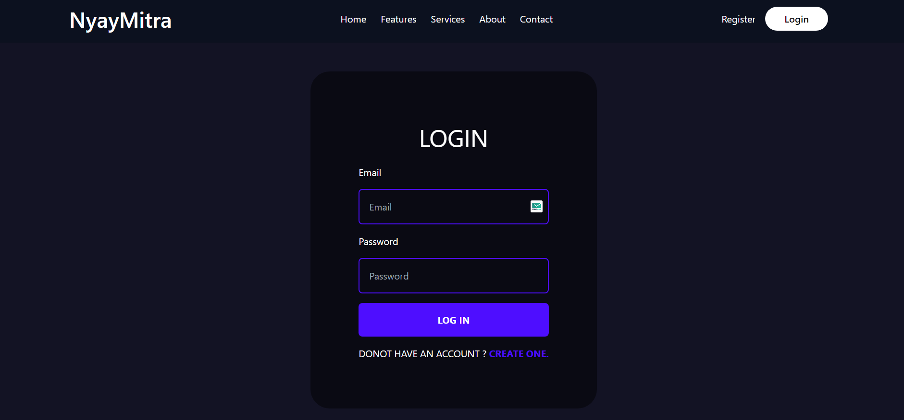
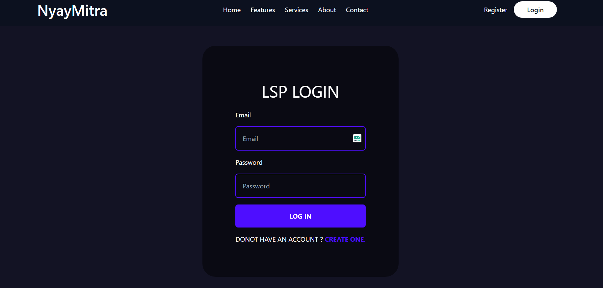
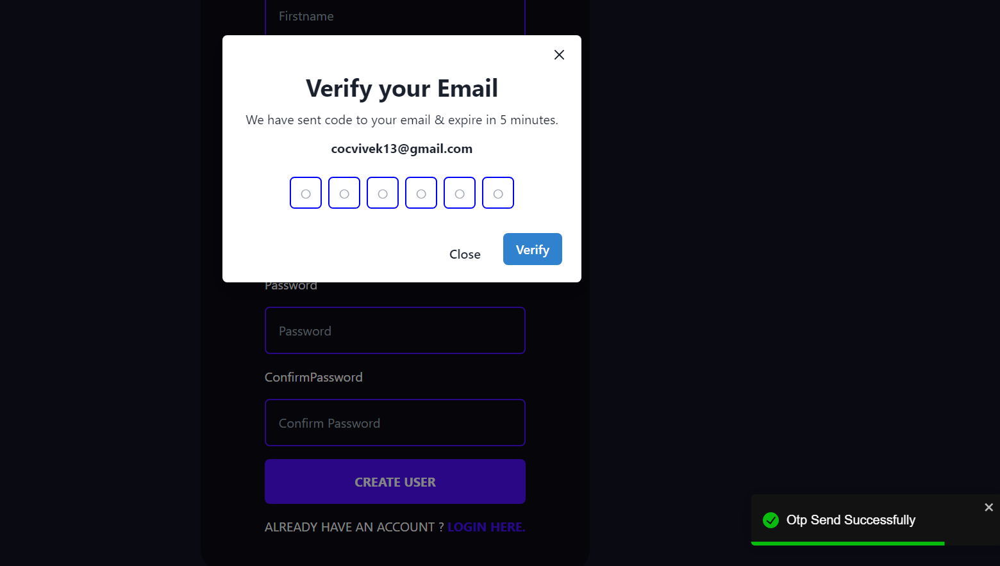

<b>Legal service Providers</b>
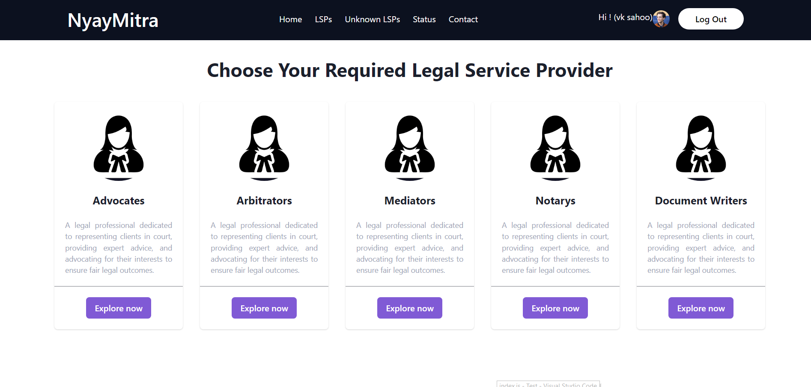
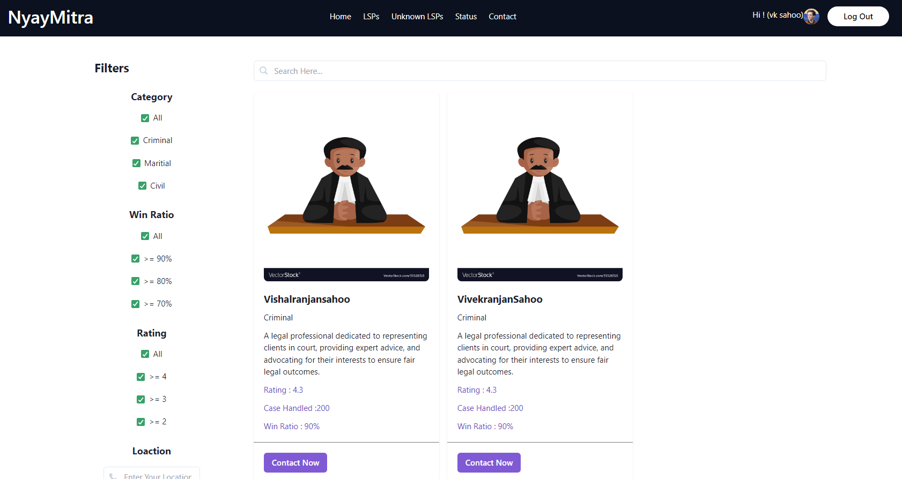
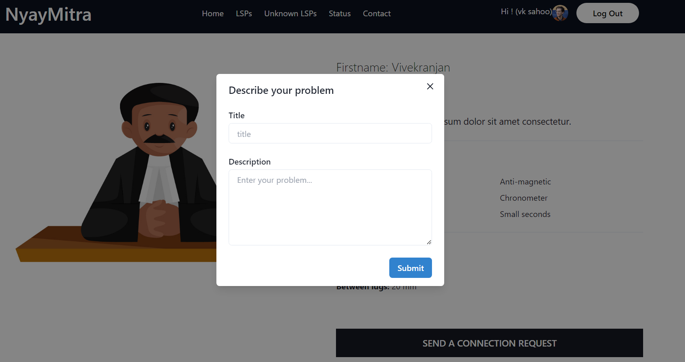

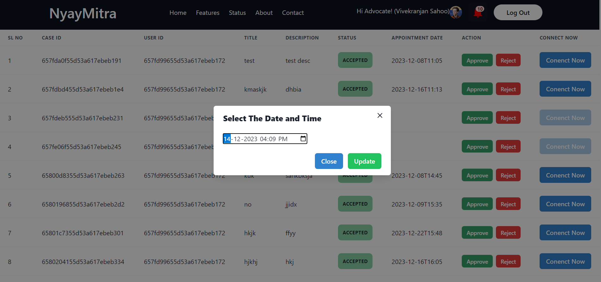
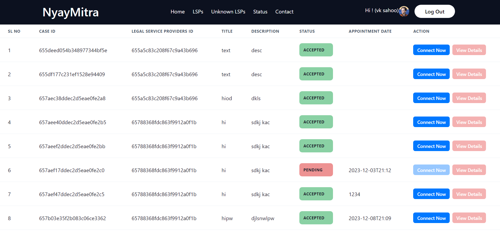

<b>Payment Method</b>
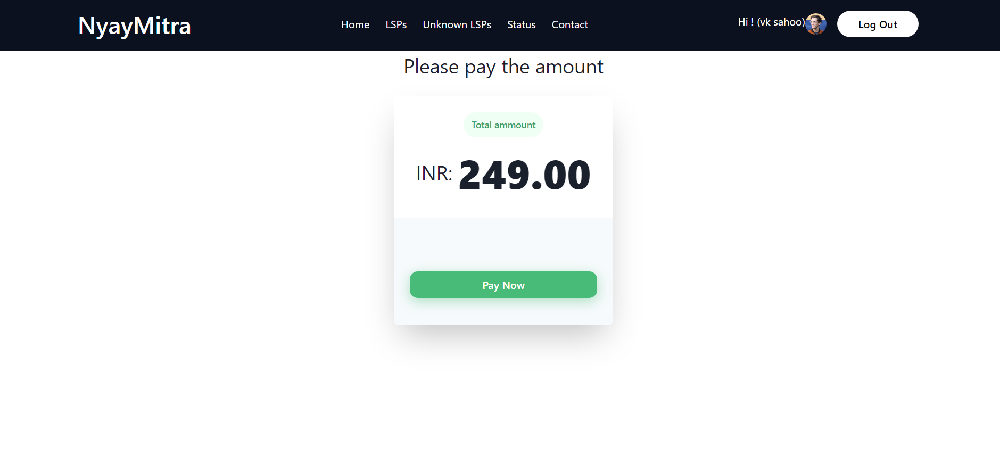
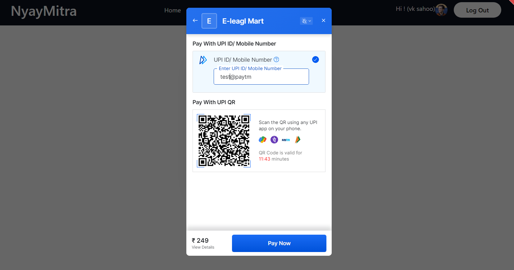
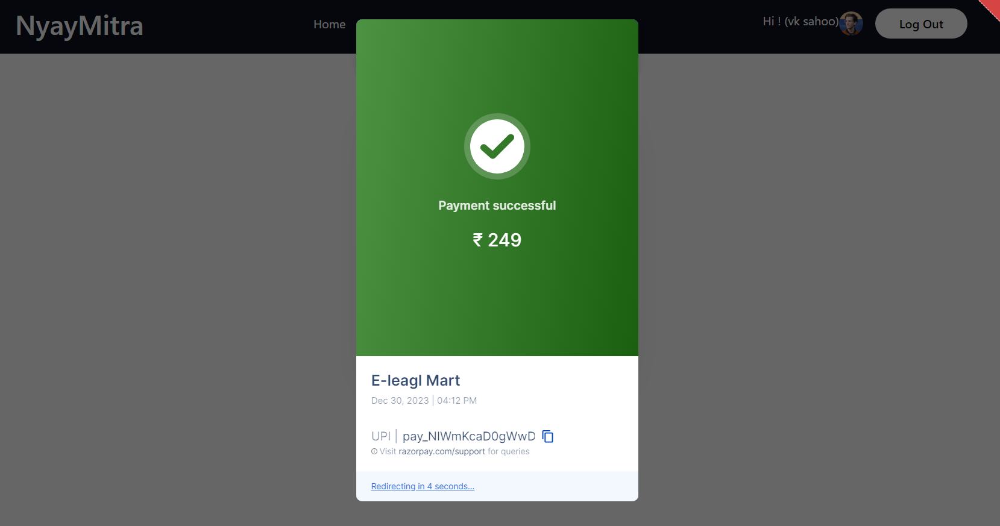

<b>Admin Page</b>
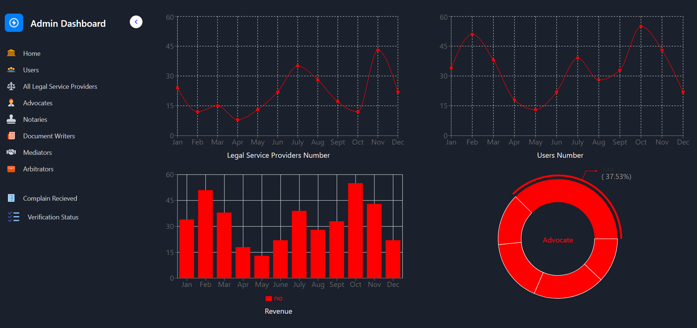
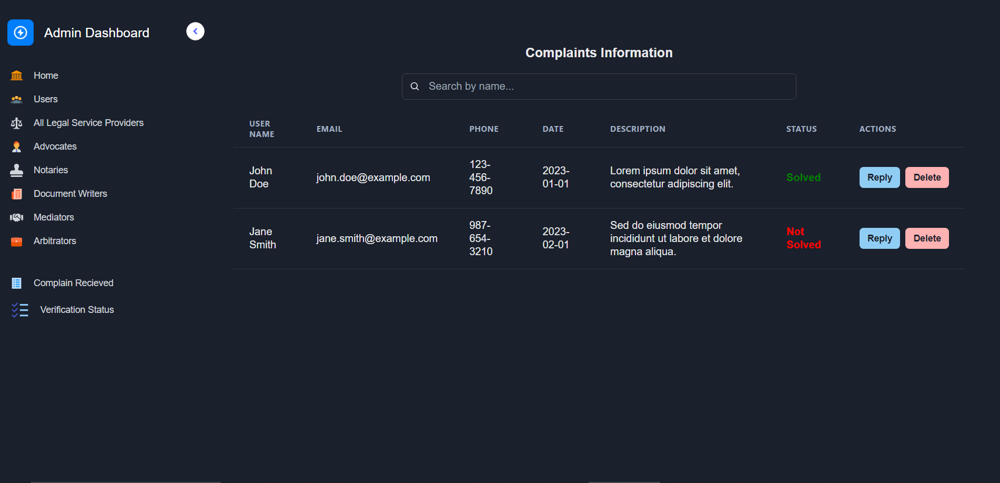
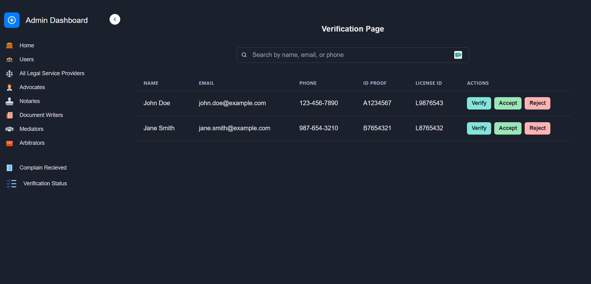
